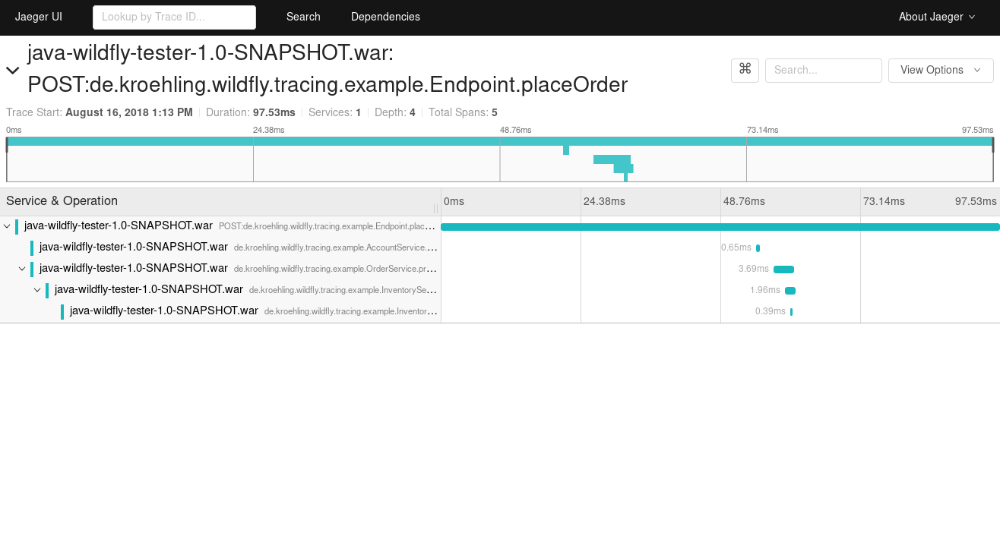

= Tester project for WildFly MicroProfile OpenTracing integration

This is a tester project based on link:https://github.com/opentracing-contrib/java-ejb[OpenTracing's Java EJB]
framework instrumentation library example. Not all features from that library are available on MicroProfile and
this code base has been changed to reflect that. Notably, this has no support for asynchronous EJBs.

== Running

First, start Jaeger backend components:

[source,bash]
----
$ docker run --rm \
    --name jaeger \
    -p6831:6831/udp \
    -p16686:16686 \
    jaegertracing/all-in-one:1.6
----

You'll also need a WildFly instance with the MicroProfile OpenTracing subsystem, such as 14.0.0.Beta2.
Download and extract it into a location that we'll call `${WILDFLY_HOME}` and start it:

[source,bash]
----
$ JAEGER_REPORTER_LOG_SPANS=true \
    JAEGER_SAMPLER_TYPE=const \
    JAEGER_SAMPLER_PARAM=1 \
    ${WILDFLY_HOME}/bin/standalone.sh
.
.
... WFLYSRV0025: WildFly Full 14.0.0.Beta2 (WildFly Core 6.0.0.CR2) started in 3797ms ...
----

Build this project and deploy it into WildFly:

[source,bash]
----
$ ./gradlew clean war
$ cp \
    build/libs/java-wildfly-tester-1.0-SNAPSHOT.war \
    ${WILDFLY_HOME}/standalone/deployments/
----

After a couple of seconds, you should see something like this in the server logs:

[source,text]
----
... WFLYSRV0010: Deployed "java-wildfly-tester-1.0-SNAPSHOT.war" (runtime-name : "java-wildfly-tester-1.0-SNAPSHOT.war")
----

At this point, your application is ready to receive requests:

[source,bash]
----
$ curl -X POST localhost:8080/java-wildfly-tester-1.0-SNAPSHOT/v1/order
----

Then, on link:http://localhost:16686/[Jaeger], a trace like the following should be available.

